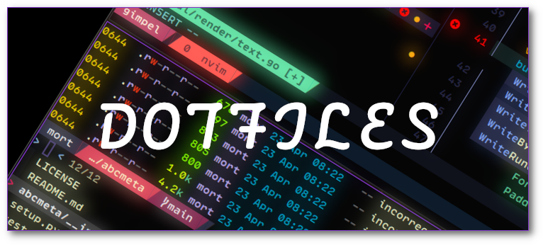
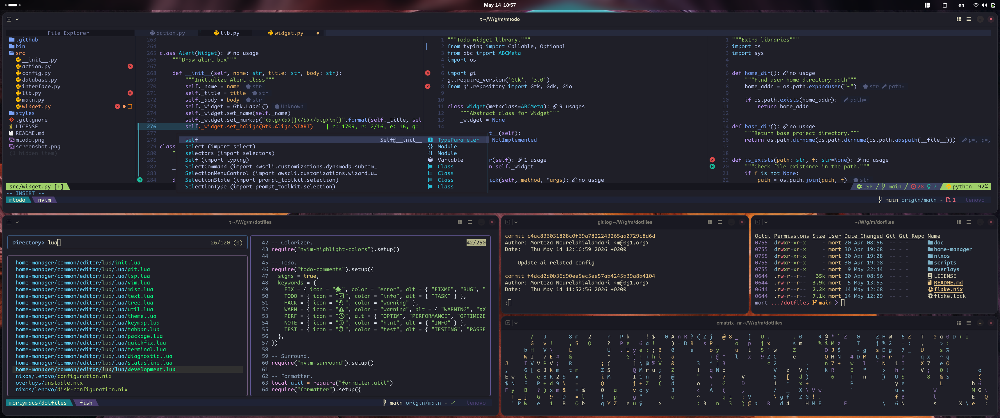

    

    
    
    

My environment config. I tried to keep it minimal and simple as much as I could.

## General config

| Category | Tool |
|----------|------|
| Distro | [NixOS](https://nixos.org/) |
| Display Manager | [LightDM](https://github.com/canonical/lightdm) |
| Window Manager | [Bspwm](https://github.com/baskerville/bspwm) |
| Hotkey daemon | [Sxhkd](https://github.com/baskerville/sxhkd) |
| Status Bar | [Polybar](https://github.com/polybar/polybar) |
| Notification | [Dunst](https://github.com/dunst-project/dunst) |
| Terminal | [Alacritty](https://github.com/alacritty/alacritty) |
| Shell | [Zsh](https://www.zsh.org) |
| Shell Prompt | [Starship](https://github.com/starship/starship) |
| Terminal Multiplexer | [Tmux](https://github.com/tmux/tmux) |
| Editor/IDE | [Neovim](https://github.com/neovim/neovim) |
| DB | [dbcli tools](https://github.com/dbcli) |
| Fonts | Display: [Lexend](https://github.com/googlefonts/lexend), [VarizMatn](https://github.com/rastikerdar/vazirmatn), Monospace: [CodeNewRoman](https://www.nerdfonts.com) |
| File Manager | [Broot](https://github.com/Canop/broot) |
| Launcher | [Rofi](https://github.com/davatorium/rofi) |
| Browser | [Firefox](https://www.mozilla.org) |
| GTK Theme | [Yaru](https://github.com/ubuntu/yaru) |
| Icon | [Yaru](https://github.com/ubuntu/yaru) |
| Wallpaper | [Unsplash](https://unsplash.com/photos/a-blurry-shot-of-a-city-street-lit-up-by-buildings-and-cars-at-night-BYu8ITUWMfc) |

## Screenshot

    

## Resources

Some good resources that I used in my config:

* https://github.com/atkrad/dotfiles/
* https://github.com/Misterio77/nix-config
* https://github.com/alizdavoodi/nix-config/

## License

Creative Commons Attribution-ShareAlike 4.0 International Public License.
Please read the [LICENSE](./LICENSE) file for more information.
