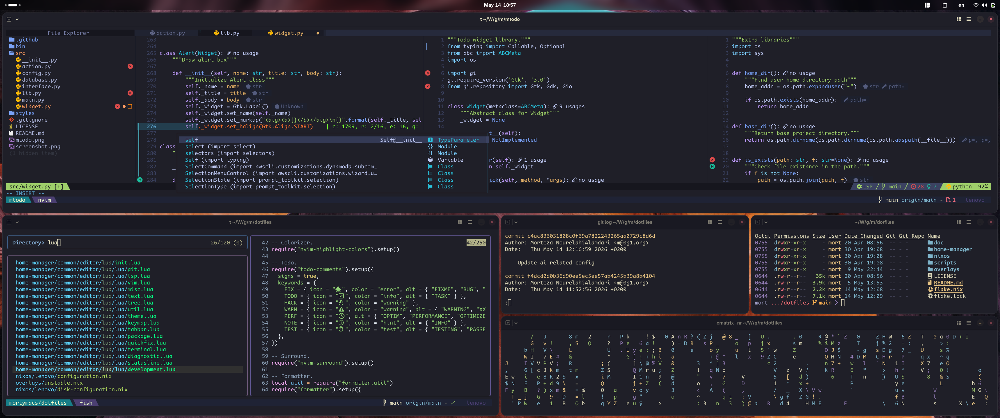

# dotfiles

My dotfiles collection.

## General config

| Category | Tool |
|----------|------|
| Distro | [NixOS](https://nixos.org/) |
| Desktop | [Gnome](https://www.gnome.org) |
| Terminal | [Ghostty](https://ghostty.org) |
| Shell | [Fish](https://fishshell.com) |
| Shell Prompt | [Starship](https://github.com/starship/starship) |
| Terminal Multiplexer | [Tmux](https://github.com/tmux/tmux) |
| Editor/IDE | [Neovim](https://github.com/neovim/neovim) |
| Browser | [Firefox](https://www.firefox.com) |
| Fonts | Display: [Adwaita](https://gitlab.gnome.org/GNOME/adwaita-fonts), [VarizMatn](https://github.com/rastikerdar/vazirmatn), Monospace: [CodeNewRoman Nerd Font](https://www.nerdfonts.com), [Noto Color Emoji](https://github.com/C1710/blobmoji) |
| Wallpaper | [Ashim D’Silva](https://unsplash.com/photos/scenery-of-mountain-canyon-WeYamle9fDM) |

## Screenshot



## Fresh Install

Boot the NixOS installer, then run (replace `PROFILE` with `lenovo`, `dell`, or `work`):

```bash
sudo nix --experimental-features "nix-command flakes" run github:nix-community/disko -- --mode disko --flake "github:mortymacs/dotfiles#PROFILE"
sudo nixos-install --flake "github:mortymacs/dotfiles#PROFILE"
sudo reboot
```

No git clone needed — flakes fetch directly from GitHub.

## Overlays

Overlays live in `overlays/` and are applied automatically to every profile.

### Add a custom package from GitHub (no flake.nix / shell.nix)

Edit `overlays/custom.nix`. The new attribute becomes available as a regular
`pkgs.myPackageName` anywhere in the config.

To get the hash, run: `nurl https://github.com/owner/repo vTAG`

**Go project:**
```nix
my-go-tool = final.buildGoModule rec {
  pname = "my-go-tool";
  version = "1.2.3";
  src = final.fetchFromGitHub {
    owner  = "some-owner";
    repo   = "my-go-tool";
    rev    = "v${version}";
    hash   = "sha256-AAAA...";
  };
  vendorHash = "sha256-BBBB...";
};
```

**C/C++ project with cmake:**
```nix
my-c-tool = final.stdenv.mkDerivation rec {
  pname = "my-c-tool";
  version = "0.5.0";
  src = final.fetchFromGitHub {
    owner  = "some-owner";
    repo   = "my-c-tool";
    rev    = "v${version}";
    hash   = "sha256-AAAA...";
  };
  nativeBuildInputs = [ final.cmake final.pkg-config ];
  buildInputs       = [ final.openssl ];
};
```

### Override an existing package (custom compile flags, patches, …)

Edit `overlays/overrides.nix`. The package keeps its original name.

**Change feature flags the package already exposes (`.override`):**
```nix
somePackage = prev.somePackage.override {
  withFeatureX = true;
  enableFoo    = false;
};
```

**Full control over the derivation (`.overrideAttrs`):**
```nix
somePackage = prev.somePackage.overrideAttrs (old: {
  configureFlags = (old.configureFlags or []) ++ [
    "--enable-foo"
    "--disable-bar"
  ];
  buildInputs = old.buildInputs ++ [ final.someLib ];
  patches     = (old.patches or []) ++ [ ./patches/somePackage-fix.patch ];
});
```

## Resources

Some good resources that I used in my config:

* https://github.com/atkrad/nixie
* https://github.com/Misterio77/nix-config
* https://github.com/alizdavoodi/nix-config/

## License
This program is free software: you can redistribute it and/or modify it under the terms of the GNU General Public License as published by the Free Software Foundation, either version 3 of the License, or (at your option) any later version.
This program is distributed in the hope that it will be useful, but WITHOUT ANY WARRANTY; without even the implied warranty of MERCHANTABILITY or FITNESS FOR A PARTICULAR PURPOSE.  See the GNU General Public License for more details.
You should have received a copy of the GNU General Public License along with this program.  If not, see <https://www.gnu.org/licenses/>.

Please read the [LICENSE](./LICENSE) file for more information.
