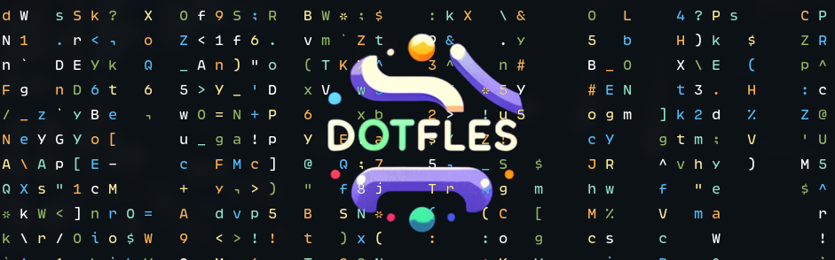

# dotfiles

    

My environment config. I tried to keep it minimal and simple as much as I could.

## General config

| Category | Tool |
|----------|------|
| Distro | ArchLinux |
| Display Manager | Ly |
| Window Manager | Bspwm |
| Hotkey daemon | Sxhkd |
| Status Bar | Polybar |
| Notification | Dunst |
| Terminal | St |
| Shell | Zsh |
| Shell Prompt | Starship |
| Terminal Multiplexer | Tmux |
| Editor/IDE | Nvim |
| DB | dbcli tools |
| Fonts | Lexend, VarizMatn, CodeNewRoman |
| File Manager | Broot |
| Launcher | Rofi |
| Browser | Firefox |
| GTK Theme | Arc Dark + BreezeX Light |
| Doc | Zeal |

## Packages

To see the list of packages, please check the [`packages`](./packages) directory.

## Screenshot

    

