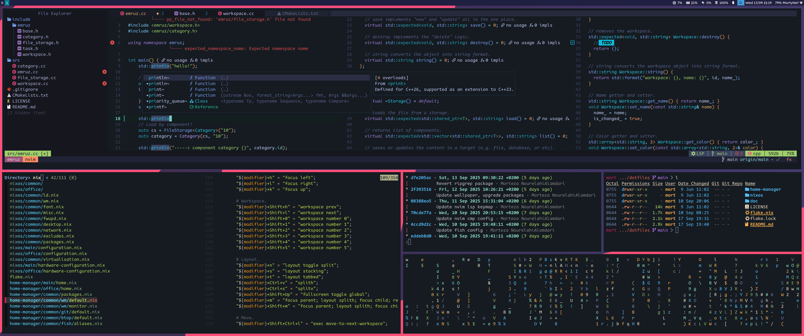

# dotfiles

My environment config. I tried to keep it minimal and simple as much as I could.

```
     888        888    .d888d8b888
     888        888   d88P" Y8P888
     888        888   888      888
 .d88888 .d88b. 888888888888888888 .d88b. .d8888b
d88" 888d88""88b888   888   888888d8P  Y8b88K
888  888888  888888   888   88888888888888"Y8888b.
Y88b 888Y88..88PY88b. 888   888888Y8b.         X88
 "Y88888 "Y88P"  "Y888888   888888 "Y8888  88888P'
```

## General config

| Category | Tool |
|----------|------|
| Distro | ArchLinux |
| Display Manager | Ly |
| Window Manager | Bspwm |
| Hotkey daemon | Sxhkd |
| Status Bar | Polybar |
| Notification | Dunst |
| Terminal | St |
| Shell | Zsh |
| Shell Prompt | Starship |
| Terminal Multiplexer | Tmux |
| Editor/IDE | Nvim |
| DB | dbcli tools |
| Fonts | Lexend, VarizMatn, CodeNewRoman |
| File Manager | Broot |
| Launcher | Rofi |
| Browser | Firefox |
| GTK Theme | Arc Dark + BreezeX Light |
| Doc | Zeal |

## Packages

To see the list of packages, please check the [`packages`](./packages) directory.

## Screenshot

<p align="center">
    
</p>
